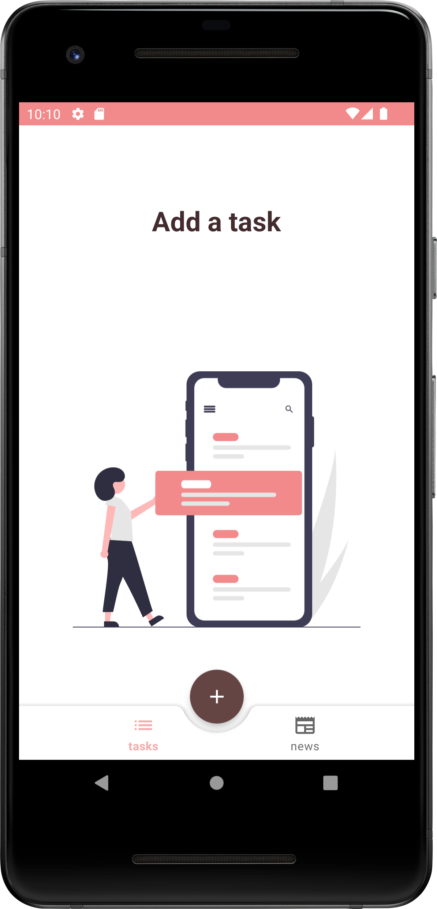
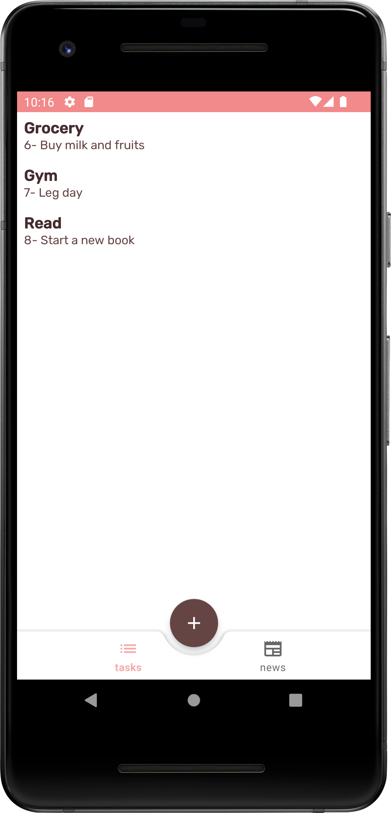
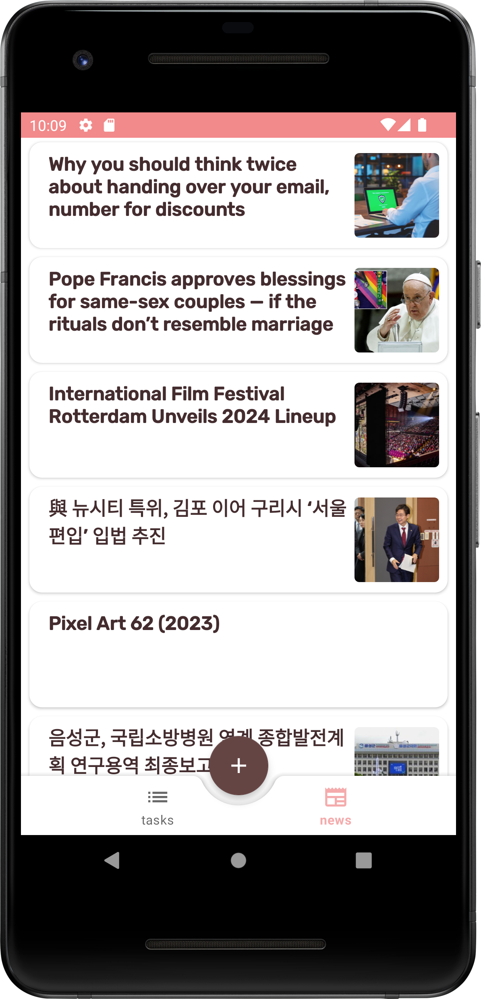

# TaskListAPP
TaskListAPP is a task list application where you can add, update, or remove tasks from your daily routine. It is seamlessly integrated with a local database on your device and consumes a news API, displaying the news in another fragment.


## :camera_flash: Screenshots
<!-- You can add more screenshots here if you like -->
&emsp;&emsp;&emsp;

## Knowledge Stack
-Kotlin
-RecyclerView
-RecyclerView Adapter
-FloatActionButton
-CRUD
-Room DataBase
-MVVM Architecture
-Unit Testing
-Retrofit
-LiveData
-API Communication

### TO DO
- Improve app styling

## Author
Jaqueline Viana 

## License
```
The MIT License (MIT)

Copyright (c) 2023 Jaqueline Viana

Permission is hereby granted, free of charge, to any person obtaining a copy of
this software and associated documentation files (the "Software"), to deal in
the Software without restriction, including without limitation the rights to
use, copy, modify, merge, publish, distribute, sublicense, and/or sell copies of
the Software, and to permit persons to whom the Software is furnished to do so,
subject to the following conditions:

The above copyright notice and this permission notice shall be included in all
copies or substantial portions of the Software.

THE SOFTWARE IS PROVIDED "AS IS", WITHOUT WARRANTY OF ANY KIND, EXPRESS OR
IMPLIED, INCLUDING BUT NOT LIMITED TO THE WARRANTIES OF MERCHANTABILITY, FITNESS
FOR A PARTICULAR PURPOSE AND NONINFRINGEMENT. IN NO EVENT SHALL THE AUTHORS OR
COPYRIGHT HOLDERS BE LIABLE FOR ANY CLAIM, DAMAGES OR OTHER LIABILITY, WHETHER
IN AN ACTION OF CONTRACT, TORT OR OTHERWISE, ARISING FROM, OUT OF OR IN
CONNECTION WITH THE SOFTWARE OR THE USE OR OTHER DEALINGS IN THE SOFTWARE.
```
